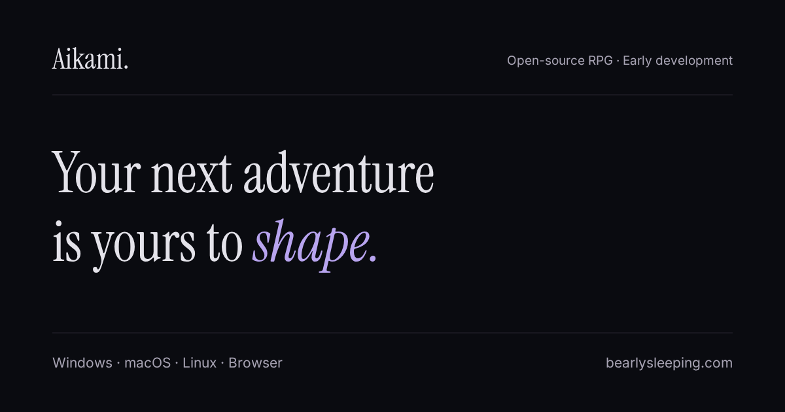

<div align="center">

# Aikami

### Imagine a campaign. Step into a world with a life of its own.

**Aikami is an open-source platform for AI-powered 2D RPG adventures in early development.**

We’re building toward a connected experience: imagine a campaign, explore its places,
meet its people, and make choices that can change their lives.

[](LICENSE)
[](#project-status)
[](https://discord.gg/XuuhWvSxHH)

**[Try the early build](https://aikami.bearlysleeping.com)** ·
**[Follow development](https://github.com/BearlySleeping/aikami)** ·
**[Discord](https://discord.gg/XuuhWvSxHH)** ·
**[Contributing](CONTRIBUTING.md)**

</div>

---

## What an Aikami adventure aims to feel like



*Vision illustration · planned experience*

Start with a place and a problem:

> Create a frontier village around an old inn. Its protective ward is fading.
> Give me a suspicious merchant, a tired guard, and a quest I can resolve
> through persuasion or combat.

This is an **illustrative example**, not generated campaign output. The vision is to
review and reshape the proposed places, people, and quest, then explore them in a spatial
2D world. Reusable structures such as inns, shops, camps, and roads could form new
environments; optional generated art could add to the project’s existing visual material.

Today, Aikami can generate and save private narrative drafts. Those drafts are not yet
compiled into playable campaigns. Persistent residents with physical routines and
town-wide consequences are also planned work.

## Project status

| Status | What it means |
| --- | --- |
| **Current build** | An authored Emberwatch adventure, a spatial 2D foundation, local saves, and private narrative drafts. |
| **In development** | Reliable first-run and quest journeys, campaign time and resident identity foundations. |
| **Planned** | Physical resident routines, grounded and recoverable town consequences, and reviewed drafts compiled into playable campaigns. |

The game’s AI helps interpret actions and narrate results. Validated actions and deterministic
game rules control what can happen. Aikami is early software; the full campaign-creation and
living-world journey is not available yet. See the [development roadmap](https://github.com/BearlySleeping/aikami/issues).

## Try the early build

Open the [web client](https://aikami.bearlysleeping.com) or download the
[desktop app](https://github.com/BearlySleeping/aikami/releases/latest). A text AI provider
is required. You can configure a local model or your own cloud provider; cloud use requires
connectivity and may cost money. Image and voice generation are optional.

No account is required for local play and saves. Saves are device-local. Fully offline play
requires a configured local text model and cached content; first-time content or model
downloads can require network access. Cloud-provider dialogue is sent to the provider you
configure.

## Develop Aikami

The repository uses Bun and Moon. Emulator environment setup writes local `.env.emulator`
files with development-safe values and does not need the encrypted production secrets key.

```bash
git clone https://github.com/BearlySleeping/aikami
cd aikami
bun install
bun run setup:env
bun run dev
```

The client dev server is available at <http://localhost:5173>. `bun run setup:env` invokes
the root `decrypt-secrets` command in emulator mode; `bun run dev` runs the Moon client dev
task. Docker is optional and only needed to run the local AI stack. See the
[local stack guide](apps/backend/local-stack/README.md) for that setup.

For project commands and validation, use the project’s Moon tasks, such as
`bun moon run client:typecheck` or `bun moon run site:build`. Read
[CONTRIBUTING.md](CONTRIBUTING.md) before opening a pull request.

## Project map

The monorepo contains the SvelteKit client and PixiJS game, an Astro landing site and docs,
a community hub, Cloudflare services, local AI services, and shared packages. The client
stores campaigns and saves on the player’s device; optional server features are separate.

For a deeper view, see the [architecture](docs/architecture/architecture.md),
[project structure](docs/guides/STRUCTURE.md), [setup guide](docs/intro/setup.md),
[developer workflow](docs/guides/dev-workflow.md), and [technical stack](docs/guides/STACK.md).
The [Local Stack README](apps/backend/local-stack/README.md) covers local text, image, and
voice services.

## Roadmap and participation

The next milestones focus on making the authored adventure reliable, giving residents
persistent routines and physical places, connecting player actions to recoverable town
changes, compiling reviewed ideas into playable campaigns, and improving community-pack
sharing. Follow current work in [GitHub Issues](https://github.com/BearlySleeping/aikami/issues).

Ideas, bug reports, and contributions are welcome. Start with
[CONTRIBUTING.md](CONTRIBUTING.md), browse
[good first issues](https://github.com/BearlySleeping/aikami/issues?q=is%3Aissue+state%3Aopen+label%3A%22good+first+issue%22),
or join [Discord](https://discord.gg/XuuhWvSxHH).

## License

The source code is [MIT licensed](LICENSE). Bundled art and audio have separate licenses;
check [LICENSE-ASSETS.md](LICENSE-ASSETS.md) and the attribution records before redistribution.
