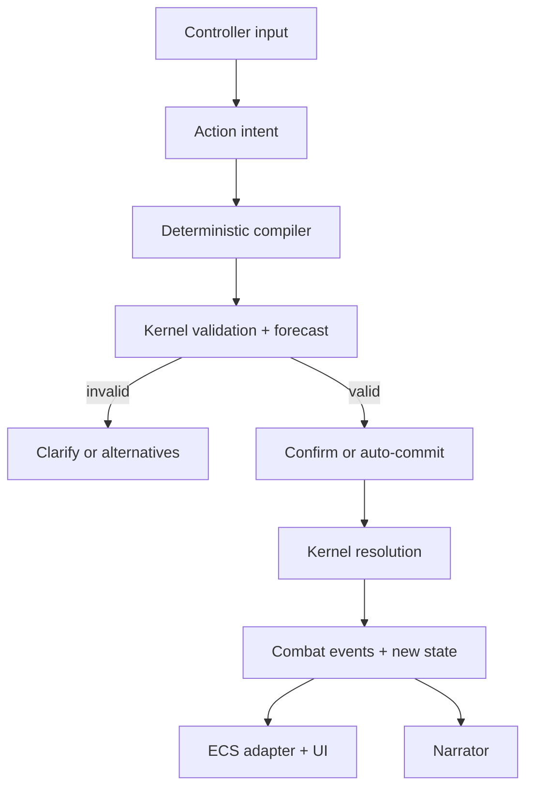

# Aikami Combat 2.0 — Deterministic Tactical Combat with LLM-Driven Intent

**Status:** Proposed  
**Date:** 2026-09-12  
**Target:** Aikami production combat (`/game`)  
**Primary decision:** LLMs choose intentions; deterministic code validates and resolves mechanics.

## 1. Executive summary

Aikami should evolve its combat system into a single deterministic tactical simulation with two interchangeable player control surfaces:

- **Direct control:** the player selects movement, actions, abilities, objects, and targets through the combat UI.
- **GM control:** the player describes an intention in natural language; an LLM translates it into the same action plan the direct UI would create.

Enemies and autonomous companions use the same intent pipeline. They may use an LLM to choose goals and tactics, but they never mutate combat state, choose dice results, or bypass legality checks. The rules kernel remains the sole mechanical authority.

The required order is:

```text
interpret intent -> compile against current state -> validate -> preview -> confirm -> resolve -> apply events -> narrate
```

This replaces the current pattern in which freeform prose is classified into a small action vocabulary and narrated before the mechanical result is fully known.

The work should be delivered as a series of small Aikami contracts. The contract pipeline is optional: each approved contract can be handed directly to OpenCode using DeepSeek V4.1 Flash. Contracts remain valuable as scope, acceptance, and review boundaries even when the pipeline itself is skipped.

## 2. Why this direction

Aikami already has many of the correct foundations:

- PixiJS + bitECS world state and spatial movement;
- collision, walkability, vision, and pathfinding infrastructure;
- a typed `GameCommand` / `GameEvent` engine boundary;
- action economy, statuses, damage types, multiple combatants, downed/revive, and role-based tactics;
- seedable random-number generation;
- a pure rules-kernel seed in `packages/shared/utils/src/lib/rules/rules_kernel.ts`;
- AI service abstractions and structured TypeBox extraction;
- production and sandbox combat UI components.

The principal problem is composition, not absence. Combat mechanics, turn sequencing, ECS mutation, enemy execution, UI state, AI interpretation, and narration currently have overlapping authority. For example, parts of `turn_manager_system.ts` still couple a player action directly to enemy processing even though the codebase also models action economy and initiative. The existing freeform schema reduces all prose to `ATTACK`, `DEFEND`, or `FLEE`, and asks the model to judge validity and write the outcome narrative before deterministic resolution.

Combat 2.0 makes these existing capabilities cooperate under one authority model instead of adding more special cases to the current resolver.

## 3. Goals

### 3.1 Player-experience goals

1. A complete encounter can be played entirely through direct tactical controls.
2. The same encounter can be played through natural-language instructions without changing rules or combat state representation.
3. The player can fluidly mix both inputs within one turn.
4. Natural-language instructions produce a visible, editable preview before commitment when the interpretation is consequential or ambiguous.
5. Companions feel like characters with goals, personality, relationships, and judgment—not damage calculators.
6. Enemies act believably, including retreating, surrendering, protecting allies, making characterful mistakes, and pursuing encounter objectives.
7. Improvised actions interact with real battlefield state rather than receiving arbitrary bonuses for eloquent prose.
8. Combat remains playable when the configured AI provider is offline, slow, rate-limited, or returns invalid output.

### 3.2 Engineering goals

1. One deterministic kernel owns legality, costs, rolls, damage, statuses, forced movement, turn progression, and outcomes.
2. Every committed action is replayable from an initial snapshot, rules version, command log, and RNG seed/state.
3. The LLM can propose only typed intents. It cannot write HP, coordinates, conditions, inventory, initiative, or dice outcomes.
4. Direct input, player language input, enemy AI, and companion AI all converge on the same command protocol.
5. UI and AI can query legal moves and forecasts without mutating state.
6. Migration can happen incrementally behind a feature flag while current combat remains available.
7. No AI or network request is placed inside the 60 fps engine loop.

## 4. Non-goals

- Reimplementing the full D&D 5e ruleset.
- Copying Marinara Engine's exact grid, classes, formulas, or UI.
- Giving an LLM direct access to ECS mutation or random-number generation.
- Generating arbitrary executable mechanics or scripts from player prose.
- Requiring AI for basic combat or for loading, saving, and resuming an encounter.
- Building multiplayer in the first release. The authority and replay model should not preclude it.
- Solving every improvised action in the first vertical slice.
- Replacing every existing combat file in one contract.

## 5. Core principles and invariants

### 5.1 One simulation, multiple controllers

Manual UI, natural-language input, companion agents, enemy agents, and deterministic fallback AI are controllers. None of them is a rules engine.

All controllers produce an `ActionIntent`. All accepted actions eventually become one or more `CombatCommand` values. Only the kernel resolves commands.

### 5.2 The kernel owns facts

The kernel is the sole authority for:

- whose turn it is;
- movement and action budgets;
- legal destinations and targets;
- range, line of sight, cover, threat, and reactions;
- ability costs, cooldowns, charges, and requirements;
- checks, saves, attack rolls, damage, and healing;
- statuses, surfaces, hazards, forced movement, death, victory, and defeat;
- turn and round progression;
- encounter objectives;
- emitted mechanical events.

The LLM may describe a desired outcome, but it cannot declare that outcome true.

### 5.3 Narration follows resolution

Outcome prose is created only from resolved `CombatEvent[]`. The narrator may change wording, tone, and emphasis, but it may not add mechanical facts absent from those events.

Attempt narration is allowed before resolution—for example, “Mara raises her bow”—but it must not claim success, damage, movement, death, or a changed battlefield.

### 5.4 Every decision is bound to a state version

Every preview or AI decision includes the `encounterId`, `turnId`, acting entity, and a deterministic `stateRevision` or state hash. A result compiled against stale state is discarded or recompiled; it is never silently applied.

### 5.5 AI failure changes presentation, not rules

If AI is unavailable:

- direct controls continue to work;
- ordinary player commands can use a small deterministic parser where possible;
- enemies and companions use deterministic GOAP/heuristic fallback;
- mechanical event text uses authored templates;
- queued or late AI output cannot modify already-resolved state.

## 6. Target architecture



### 6.1 Layer responsibilities

| Layer | Responsibilities | Must not do |
|---|---|---|
| Controller | Capture clicks, text, AI goals, or fallback policy | Mutate combat state |
| Intent interpreter | Convert language into typed semantic intent | Pick coordinates, rolls, or final outcomes |
| Action compiler | Resolve selectors, path, target, ability, and object affordances against a snapshot | Mutate state or invent unavailable capabilities |
| Rules kernel | Validate, forecast, resolve, advance RNG, and emit events | Call AI, render UI, access ECS, database, or network |
| Engine adapter | Create snapshots, invoke kernel, apply returned state/events to ECS | Recalculate rules independently |
| UI projection | Render state, previews, prompts, animation, and logs | Become authoritative state |
| Narrator | Turn resolved events into characterful prose/voice | Add or change mechanics |
| Replay store | Persist initial snapshot, seed/state, commands, intents, and events | Execute rules |

### 6.2 Repository placement

Use existing Aikami boundaries first. Do not create a new package merely to make the architecture look cleaner.

- Shared TypeBox schemas: `packages/shared/schemas/src/lib/game/combat/`
- Derived domain types: `packages/shared/types/src/lib/game/combat/`
- Pure rules implementation: evolve `packages/shared/utils/src/lib/rules/` behind a stable combat-kernel facade
- ECS snapshot/apply adapter and spatial compiler: `packages/frontend/engine/src/combat/`
- Bridge commands/events: existing engine boundary types, with shared serializable payloads
- AI intent and narration adapters: client services behind existing AI abstractions
- Svelte projections and input: existing combat ViewModel/view hierarchy
- Deterministic fallback tactics: adapt the existing GOAP combat tactics system

If the pure rules area becomes a clear standalone domain with several internal modules and non-game consumers, a later contract may extract it into a dedicated package. That package move is not a prerequisite for the first vertical slice.

## 7. Canonical data flow

### 7.1 Direct player action

1. The player selects an actor, movement destination, ability, target, or battlefield object.
2. The UI sends a preview query through `EngineBridge`.
3. The engine builds a serializable combat snapshot and calls the compiler/kernel without mutation.
4. The UI receives a path, valid targets, costs, hit/damage forecast, consequences, and warnings.
5. The player confirms.
6. The UI sends the proposed plan and the state revision it was based on.
7. The kernel validates again, resolves using deterministic RNG, and returns the new state plus events.
8. The ECS adapter applies the result once and emits UI-relevant bridge events.
9. Animation and narration consume the resolved events.

### 7.2 Natural-language player action

1. The player submits text, optionally with selected entity/object context.
2. The interpreter returns semantic intent only.
3. The compiler resolves words such as “nearest,” “safest,” “behind,” “that barrel,” and “melee range” from current mechanical state.
4. Validation returns either a preview, structured alternatives, or a clarification request.
5. Obvious low-risk actions may auto-commit if the player enables that preference. Ambiguous, destructive, resource-consuming, or reaction-triggering actions require confirmation.
6. Resolution then follows the same path as direct input.

### 7.3 NPC or companion turn

1. At the end of the preceding committed action, the coordinator builds a perception-limited decision snapshot for the next AI-controlled actor.
2. The tactical-facts service supplies engine-computed facts: reachable enemies, cover positions, danger, expected ranges, objectives, cooldowns, and legal capabilities.
3. The LLM selects a goal, semantic intent, target selector, and fallback.
4. The deterministic compiler turns that choice into a legal plan.
5. The kernel validates and resolves it when the turn is current and the state revision still matches.
6. Invalid, stale, timed-out, or malformed decisions fall back to deterministic tactics.

## 8. Domain model

These shapes are conceptual. Each implementation contract must finalize TypeBox schemas and derived TypeScript aliases according to Aikami conventions.

### 8.1 Combat state

```ts
type CombatState = {
  schemaVersion: number;
  rulesVersion: string;
  encounterId: string;
  stateRevision: number;
  round: number;
  phase: 'starting' | 'active' | 'reaction' | 'ended';
  seed: number;
  rngState: number;
  initiative: InitiativeState;
  combatants: Record<string, CombatantState>;
  battlefield: BattlefieldState;
  objectives: CombatObjectiveState[];
  pendingReaction?: ReactionWindow;
  outcome?: CombatOutcome;
};

type TurnBudget = {
  movementRemaining: number;
  actionAvailable: boolean;
  quickActionAvailable: boolean;
  reactionAvailable: boolean;
};
```

Persistent IDs must not be raw bitECS entity IDs. The ECS adapter maps stable combatant IDs to current runtime entity IDs. This prevents replay, save/load, and entity-generation reuse bugs.

### 8.2 Action intent

An intent expresses desire without claiming mechanical facts.

```ts
type ActionIntent = {
  intentId: string;
  encounterId: string;
  actorId: string;
  basedOnRevision: number;
  source: 'direct' | 'player_language' | 'companion_llm' | 'enemy_llm' | 'fallback_ai';
  steps: IntentStep[];
  constraints?: IntentConstraint[];
  fallback?: IntentStep[];
};

type IntentStep =
  | { kind: 'move'; destination: LocationSelector; stopAt?: RangeBand }
  | { kind: 'use_ability'; ability: AbilitySelector; target: TargetSelector }
  | { kind: 'interact'; object: ObjectSelector; interaction?: string }
  | { kind: 'defend' }
  | { kind: 'disengage' }
  | { kind: 'wait' }
  | { kind: 'end_turn' }
  | { kind: 'attempt_improvised_action'; description: string; subjects: EntitySelector[] };
```

Example interpretation of “I move to the nearest enemy and use melee attack”:

```json
{
  "source": "player_language",
  "steps": [
    {
      "kind": "move",
      "destination": { "relativeTo": { "kind": "nearest_hostile" } },
      "stopAt": "melee"
    },
    {
      "kind": "use_ability",
      "ability": { "kind": "tag", "value": "basic_melee" },
      "target": { "kind": "previous_target" }
    }
  ]
}
```

The model does not name a tile or promise that both steps fit the budget.

### 8.3 Compiled action plan

```ts
type ActionPlan = {
  planId: string;
  intentId: string;
  encounterId: string;
  actorId: string;
  basedOnRevision: number;
  commands: CombatCommand[];
  forecast: ActionForecast;
  assumptions: ResolvedAssumption[];
  warnings: ActionWarning[];
};
```

The plan contains resolved targets and positions. It is still only a proposal. The kernel revalidates it on commit.

### 8.4 Commands

Start with a deliberately bounded vocabulary:

```ts
type CombatCommand =
  | { kind: 'move'; actorId: string; path: GridPoint[] }
  | { kind: 'useAbility'; actorId: string; abilityId: string; targetIds: string[] }
  | { kind: 'interact'; actorId: string; objectId: string; interactionId: string }
  | { kind: 'defend'; actorId: string }
  | { kind: 'disengage'; actorId: string }
  | { kind: 'wait'; actorId: string }
  | { kind: 'endTurn'; actorId: string }
  | { kind: 'respondToReaction'; actorId: string; reactionId: string; choice: string };
```

Do not make `CombatCommand` an unbounded “patch” object. New mechanics must enter through explicit variants with validation and tests.

### 8.5 Validation and forecast

```ts
type ValidationResult =
  | { valid: true; normalizedPlan: ActionPlan }
  | {
      valid: false;
      reasonCode: CombatInvalidReason;
      messageKey: string;
      alternatives: SuggestedPlan[];
    };

type ActionForecast = {
  path?: GridPoint[];
  movementCost?: number;
  actionCost: ActionCost;
  hitChance?: number;
  damageRange?: { minimum: number; maximum: number };
  affectedCells?: GridPoint[];
  affectedEntityIds?: string[];
  reactionRisks: ReactionRisk[];
  objectiveEffects: ObjectiveForecast[];
};
```

Forecasts are advisory projections generated by deterministic code. The committed resolution may differ because of dice or intervening reactions, but never because the LLM silently changed the plan.

### 8.6 Events

Events are facts and the common integration surface for ECS, UI, audio, animation, persistence, and narration.

Representative variants include:

```text
turnStarted
movementCommitted
movementInterrupted
reactionOffered
reactionResolved
attackRolled
saveRolled
damageApplied
healingApplied
conditionApplied
forcedMovementApplied
objectStateChanged
surfaceCreated
objectiveUpdated
combatantDowned
combatantDefeated
moraleChanged
turnEnded
combatEnded
```

Every event should include encounter/turn/revision identity and the minimum structured context necessary to project or narrate it.

## 9. Turn model

Use a real turn budget:

- movement;
- action;
- quick action;
- reaction;
- explicit end turn.

Movement may be split before and after actions unless a status or ability says otherwise. Executing an action does not implicitly run every enemy turn. The turn coordinator advances only on `endTurn`, exhaustion of all available choices under an explicit auto-end policy, defeat/incapacitation, or a rule-defined forced end.

Grouped initiative can be added after the basic turn model is stable. Adjacent allied initiative slots may form a group in which eligible allies interleave actions. This is especially useful for companion suggestions and combination plays, but it must not complicate the first kernel contract.

Reactions create a bounded sub-state rather than recursively invoking arbitrary turns. Each player-controlled reaction supports a policy:

- **Ask:** pause briefly and show choices;
- **Auto:** use when deterministic policy conditions match;
- **Never:** decline automatically.

AI-controlled reactions use their decision policy or deterministic fallback without an extra blocking model call whenever possible.

## 10. Spatial battlefield

The exploration world should become the default battlefield. Preserve encounter positions and use existing world collision/pathfinding infrastructure.

Combat adds a tactical projection over that world:

- movement budget and reachable area;
- legal endpoint filtering;
- melee/ranged range;
- line of sight;
- partial/full cover;
- threat zones and reaction paths;
- surfaces and hazards;
- battlefield-object affordances;
- objective zones.

The initial implementation may quantize continuous world positions to game cells for deterministic tactical calculations while retaining smooth PixiJS movement for presentation. The quantization and tie-breaking rules must be explicit and stable.

The existing left-versus-right combat stage may remain temporarily as a legacy presentation or accessibility option, but it must not remain the mechanical source of positions.

## 11. Natural-language action compiler

### 11.1 Split semantic interpretation from grounding

The LLM is good at mapping language into concepts:

- “nearest enemy”;
- “the archer who shot Mara”;
- “somewhere safe”;
- “get behind the brute”;
- “use my strongest fire spell”;
- “kick this barrel toward them.”

Deterministic code is better at grounding those concepts into current facts:

- exact target ID;
- reachable destination;
- shortest or safest legal path;
- known ability ID;
- resource cost;
- line of sight and range;
- opportunity-reaction risk;
- whether the referenced object exists and exposes the requested affordance.

The interpreter therefore emits selectors and constraints, not IDs it guessed from a prompt dump.

### 11.2 Clarification policy

Ask a clarification only when different plausible interpretations materially change cost, risk, target, or outcome. Otherwise choose the safest reasonable interpretation and show it in the preview.

Examples:

- “Attack the goblin” with three equally visible goblins: ask or highlight alternatives.
- “Attack the nearest goblin” with a unique nearest target: preview directly.
- “Use a potion” with healing and fire-resistance potions: ask.
- “Move closer” when many endpoints are equivalent: choose the safest legal endpoint and preview it.

### 11.3 Confirmation policy

Default confirmation is required when a plan:

- consumes a limited resource;
- triggers a known reaction;
- affects allies or civilians;
- uses an improvised environmental action;
- has an ambiguous target;
- ends the turn;
- has a materially different interpretation from the literal wording.

Routine unambiguous actions may auto-commit under a player preference. The preview still appears briefly and supports undo-before-resolution only; resolved dice and events are never rewound as a normal input correction.

## 12. LLM-driven enemies and companions

### 12.1 Decision input

Give each actor only information it may perceive, plus deterministic tactical facts. A decision snapshot should contain:

- identity, role, personality, relationships, fears, and current emotional state;
- encounter objectives and current priorities;
- visible combatants and last-known facts where applicable;
- health bands, conditions, resources, and legal capabilities;
- reachable target summaries and candidate tactical positions;
- imminent observable threats;
- morale, risk tolerance, and obedience/autonomy rules;
- recent relevant combat events;
- a strict token budget.

Do not send raw full ECS state, hidden enemies, irrelevant campaign history, or hundreds of path nodes.

### 12.2 Decision output

```ts
type AiCombatDecision = {
  encounterId: string;
  actorId: string;
  basedOnRevision: number;
  goal: string;
  intent: IntentStep[];
  fallback: IntentStep[];
  confidence: 'low' | 'medium' | 'high';
  shortReason?: string;
  proposedLine?: string;
};
```

`shortReason` is trace/debug data, not hidden chain-of-thought. Store only concise decision rationale.

### 12.3 Character over perfect optimization

The tactical-facts service may provide strong options, but the agent prompt should permit characterful suboptimality:

- a coward avoids danger or flees;
- a loyal guard protects the commander;
- a vengeful enemy pursues the character who harmed them;
- a principled companion refuses an immoral command;
- a panicked creature may choose a poor escape route;
- a disciplined squad coordinates focus fire.

Difficulty should alter coordination, risk tolerance, resources, telegraphing, and encounter composition—not deliberately reduce model intelligence.

### 12.4 Latency strategy

- Start planning the next AI turn as soon as the preceding committed action produces a stable revision.
- Batch low-importance enemies from the same squad into one call while preserving a separate decision per actor.
- Give bosses and important companions separate richer calls.
- Use a hard decision deadline. On timeout, execute deterministic fallback immediately.
- Cache stable character, ability, and encounter-instruction prefixes where the provider supports prompt caching.
- Send deltas or concise recent events rather than repeatedly dumping an entire transcript.
- Never wait for narration before allowing the next mechanical/UI step.

### 12.5 Companion control modes

Each companion supports:

| Mode | Behavior |
|---|---|
| Direct | Player controls every action |
| Suggest | Companion proposes a plan; player approves or edits it |
| Intent | Player supplies a standing goal; companion chooses execution |
| Autonomous | Companion decides and commits under configured confirmation rules |

Control mode is a player preference, not a separate rules path.

## 13. Improvised and environmental actions

Do not model a custom action as “creative prose = bonus damage.” Model the environment with authored affordances and let the LLM connect language to those affordances.

### 13.1 Object affordances

```ts
type BattlefieldObject = {
  id: string;
  tags: string[];
  position: GridPoint;
  state: Record<string, string | number | boolean>;
  affordances: ObjectAffordance[];
};

type ObjectAffordance = {
  id: string;
  kind: 'move' | 'break' | 'ignite' | 'extinguish' | 'open' | 'close' | 'cut_support' | 'take_cover';
  actionCost: ActionCost;
  requirements: MechanicalRequirement[];
  check?: CheckDefinition;
  effects: MechanicalEffect[];
};
```

Example authored state:

```yaml
id: brazier_01
tags: [flammable-source, movable, hot]
affordances:
  - id: tip_over
    kind: move
    requirements: [adjacent, free-hand]
    check: { ability: strength, dc: 11 }
    effects: [forced-move-object, create-fire-surface]
```

“Kick the brazier into the oil” can then compile into known interactions plus a check. If the brazier is absent, out of reach, fixed in place, or already extinguished, the compiler rejects or proposes alternatives.

### 13.2 Initial generic effect vocabulary

Support a bounded set first:

- shove/forced movement;
- grapple/restrain;
- take or destroy cover;
- break/move/ignite/extinguish an object;
- create/remove a surface;
- improvised attack;
- distract/assist;
- apply a registered condition;
- interact with an encounter objective.

The LLM may compose registered effects, but it may not generate new effect code or arbitrary numbers at runtime.

### 13.3 GM adjudication

For an action requiring judgment:

1. The LLM proposes relevant affordances, an intended approach, and possibly a check category.
2. Deterministic policy selects or bounds action cost, ability, difficulty, save, effect magnitude, and valid targets from authored rules.
3. The kernel performs the roll.
4. Events record success/failure and resulting state changes.
5. The GM narrates those events.

The GM “handles the dice” in presentation, but the kernel owns them mechanically.

## 14. Encounter objectives, morale, and readable intent

Combat objectives must be first-class state rather than narration-only goals. Initial objective kinds should include:

- defeat or rout a group;
- survive for a number of rounds;
- reach, hold, protect, destroy, or interact with a target;
- stop a ritual or escape;
- protect civilians;
- negotiate surrender.

Morale is also mechanical state. It can be affected by leader defeat, allies falling, overwhelming damage, objectives becoming impossible, fear conditions, or personality. A morale threshold may unlock retreat, surrender, bargain, or reckless behavior.

Enemy decisions should expose an observable intention projection without exposing private model text:

```text
Goblin Archer — watching Mara; preparing a ranged attack
Ogre — enraged; likely to charge the player
Cultist — maintaining the ritual
```

Perception or insight mechanics can reveal more precise intentions. This turns AI decision-making into readable gameplay rather than invisible randomness.

## 15. Rules-kernel API

The kernel should expose a small pure API. Naming may change during contract drafting, but responsibilities must remain separate.

```ts
type CombatKernel = {
  getLegalActions(input: LegalActionQuery): LegalActionSet;
  compile(input: CompileActionInput): CompileActionResult;
  validate(input: ValidateActionInput): ValidationResult;
  forecast(input: ForecastActionInput): ActionForecast;
  resolve(input: ResolveActionInput): ResolveActionResult;
  replay(input: ReplayCombatInput): ReplayCombatResult;
};
```

`resolve` returns a complete new immutable combat state, emitted events, and updated RNG state. The input is never mutated.

The ECS adapter may apply a returned state diff for performance, but that diff is derived from the kernel result. It does not become a second authority.

## 16. Bridge and UI integration

Add explicit request/response messages rather than overloading the current generic combat action path.

Representative commands:

```text
COMBAT_PREVIEW_REQUESTED
COMBAT_PLAN_COMMITTED
COMBAT_REACTION_SELECTED
COMBAT_TURN_ENDED
COMBAT_LANGUAGE_INTENT_SUBMITTED
```

Representative events:

```text
COMBAT_SNAPSHOT_CHANGED
COMBAT_PREVIEW_READY
COMBAT_PLAN_REJECTED
COMBAT_EVENTS_RESOLVED
COMBAT_REACTION_OPENED
COMBAT_DECISION_PENDING
COMBAT_AI_DEGRADED
```

Only UI-relevant updates cross the bridge. Per-frame position interpolation and animation remain in the engine.

The combat ViewModel holds presentation state such as selection, pending text, preview, confirmation, loading, and log projections. It does not duplicate HP, turn order, or rules state as a second mutable source of truth.

## 17. Determinism, replay, and observability

For each encounter, record:

```ts
type CombatReplay = {
  replayVersion: number;
  rulesVersion: string;
  initialState: CombatState;
  decisions: DecisionRecord[];
  committedPlans: ActionPlan[];
  events: CombatEvent[];
  finalState?: CombatState;
};
```

A `DecisionRecord` contains input identity, state revision, semantic intent, compiled plan ID, provider/model metadata where applicable, latency, fallback reason, and concise rationale. It must not store provider secrets or private chain-of-thought.

Required guarantees:

1. Replaying the same initial state, rules version, command sequence, and RNG seed/state produces byte-equivalent mechanical events and final state.
2. Narration differences never affect replay.
3. A committed plan is applied at most once.
4. Save/load during combat resumes from a versioned snapshot and command position.
5. Logs clearly distinguish interpretation failure, stale state, validation rejection, provider timeout, fallback use, and kernel invariant failure.

Development tooling should include a replay viewer or at minimum a CLI/test helper that reports the first divergent state revision and event.

## 18. Performance and reliability budgets

Initial budgets should be measured and revised from production traces:

- Kernel validate/forecast/resolve: target under 8 ms for an ordinary action on supported hardware.
- Tactical preview response: target within one rendered frame for ordinary actions.
- AI decision soft budget: 1.5 seconds; display a subtle thinking state.
- AI decision hard budget: 4 seconds; execute fallback when exceeded.
- No engine frame waits on AI or narration promises.
- State sent to an AI decision should be bounded by role and perception, not by the size of the entire campaign.

All AI requests must support cancellation. Responses are idempotent by decision ID and rejected when late or stale.

## 19. Persistence and migration

Combat 2.0 requires versioned snapshots because persistent combat may outlive a deployment.

- Old saves not currently in combat continue loading normally.
- Saves in legacy combat either resume through the legacy implementation or restart the encounter from a stored pre-combat checkpoint. Choose one behavior explicitly in the migration contract.
- New combat snapshots include `schemaVersion` and `rulesVersion`.
- Replay compatibility is guaranteed only for rules versions retained by the application. If an old rules implementation is removed, migrate the snapshot or retain the final resolved state as non-replayable history.
- Feature flags select legacy or Combat 2.0 at encounter start; an encounter never changes engine mid-fight.

## 20. Security, privacy, and prompt-injection boundaries

Player-authored and content-pack text is untrusted data. It must not be concatenated into privileged agent instructions.

- Use structured fields and schema validation for all model output.
- Separate system rules from character dialogue, descriptions, and user actions.
- Treat model-returned IDs, numbers, tool-like text, and claims as proposals requiring deterministic lookup and bounds.
- Exclude secrets, hidden developer instructions, hidden entities, and unrelated private campaign history from combat prompts.
- Cap all free-text fields and reject unknown properties.
- Never execute code or dynamic expressions supplied by a model or content pack.

## 21. Testing strategy

### 21.1 Kernel tests

- table-driven tests for every command and invalid-reason code;
- same seed + same commands = same events/state;
- input snapshots are never mutated;
- property tests for HP/resource bounds, path legality, action-budget conservation, target ownership, and monotonic state revision;
- fuzz malformed commands and snapshots;
- golden replays for representative encounters;
- reaction-window and stale-revision tests.

### 21.2 Compiler tests

- selector grounding with deterministic tie-breaks;
- nearest/safest/behind/melee-range semantics;
- multi-step budget fitting;
- explicit rejection or alternatives when a requested step cannot be completed;
- object-affordance matching;
- no hidden-information leakage.

### 21.3 AI adapter tests

- fixture outputs for valid, invalid, partial, malformed, timeout, and refused responses;
- schema validation and bounded retry;
- stale responses discarded;
- fallback action always legal;
- prompt snapshots contain only permitted perception fields;
- narration contains no mechanical outcome absent from events.

Do not assert exact prose from a live model. Test schemas, facts, policy, and deterministic fallback.

### 21.4 Production E2E

The proof encounter is:

- player + one companion versus three enemies;
- an overturned table, brazier, oil surface, and breakable support;
- at least one non-kill objective or morale outcome;
- direct-control completion;
- natural-language completion;
- companion proposal and player override;
- an environmental action;
- AI-offline fallback completion;
- save/reload or deterministic replay verification.

The production journey must start from `/game`, enter combat through the real encounter path, resolve victory/defeat, and return to exploration. A sandbox-only demonstration is insufficient.

## 22. Rollout plan and contract decomposition

Do not create one “build Combat 2.0” contract. Use the design document as the north star and make each contract independently reviewable. Allocate live `C-xxx` IDs only when drafting to avoid collisions.

| Slice | Outcome | Depends on | Suggested scope |
|---|---|---|---|
| Prerequisite | Current production combat opens, runs, and exits reliably | Existing C-500 | Finish/verify C-500 before architectural migration |
| Combat-01 | Versioned combat schemas and pure kernel authority | Prerequisite | State, commands, events, validation, RNG/replay invariants; no new UI |
| Combat-02 | Real turn coordinator and action budgets | Combat-01 | Remove implicit player-action-to-enemy-chain coupling; explicit end turn |
| Combat-03 | World-space tactical queries and previews | Combat-01 | Movement budget, legal endpoints, range, LoS, forecast bridge API |
| Combat-04 | Direct-control production vertical slice | Combat-02/03 | Play proof encounter with clicks; legacy mechanics behind flag |
| Combat-05 | Natural-language intent and confirmation UX | Combat-04 | Ordinary move/attack/ability instructions; clarification and fallback |
| Combat-06 | Companion/enemy LLM intent agents | Combat-04 | Perception snapshots, prefetch, deadlines, GOAP fallback, control modes |
| Combat-07 | Affordances and improvised actions | Combat-05/06 | Objects, checks, generic effects, post-resolution narration |
| Combat-08 | Objectives, morale, reactions, and release gate | Prior slices | Encounter depth, replay evidence, AI-offline E2E, rollout decision |

### 22.1 First contract recommendation

After C-500 is genuinely production-verified, draft **Combat-01** first. It should:

- define versioned `CombatState`, `CombatCommand`, `CombatEvent`, and validation schemas;
- expand the existing pure rules kernel behind a combat facade;
- make RNG state explicit and serializable;
- introduce stable combatant IDs distinct from bitECS entity IDs;
- resolve a minimal move, basic attack, defend, wait, and end-turn command;
- prove replay equivalence and immutability in tests;
- add an ECS adapter in read/apply form without yet replacing production combat;
- explicitly exclude natural language, LLM decisions, reactions, cover, and improvised actions.

This contract creates the seam every later feature needs while staying small enough for reliable agent implementation.

### 22.2 Feature-flag migration

Introduce an encounter-start flag such as `combatEngine: 'legacy' | 'v2'`. Keep it internal or developer-only until Combat-04 passes the production vertical slice. Do not branch throughout the codebase; choose a combat composition once at encounter start and route through an adapter.

Remove legacy combat only after:

- production direct-control E2E passes;
- AI-offline fallback passes;
- save/reload behavior is defined;
- replay invariants pass;
- no required behavior exists only in the legacy resolver.

## 23. Direct OpenCode implementation workflow

### 23.1 Recommendation

Keep Aikami contracts, but skip the automated contract pipeline initially.

Use this loop:

```text
design doc -> draft one contract -> human approval -> OpenCode implementation
           -> targeted tests -> full validation -> fresh review -> human merge
```

The contract is the unit of scope and evidence. OpenCode is the executor. This removes the brittle PTY/pipeline layer without giving up specification discipline, archaeology, or acceptance criteria.

### 23.2 OpenCode and DeepSeek setup

Use OpenCode's current provider discovery instead of hardcoding a model alias that may be renamed:

1. Run OpenCode.
2. Use `/connect` and select DeepSeek.
3. Use `/models` and select the current **DeepSeek V4.1 Flash** entry.
4. If storing it in project configuration, copy the exact `provider/model-id` displayed by the installed OpenCode version.

DeepSeek's current API canonical name is `deepseek-flash`; retired V4 aliases may still route to V4.1 temporarily. Prefer the canonical/current entry shown by OpenCode rather than relying on a compatibility alias.

Start with the model/provider defaults known to work in the current OpenCode release. DeepSeek reports its coding-agent evaluation used maximum effort, `top_p = 0.95`, and `temperature = 1.0`; treat those as a benchmark baseline, then evaluate on Aikami contracts rather than assuming they are optimal for every task. Pin the OpenCode version used for long-running work because model reasoning/tool-call handling has changed across releases.

### 23.3 Project agent

Create `.opencode/agents/aikami-contract.md`:

```md
---
description: Implements one approved Aikami contract and verifies every acceptance criterion
mode: primary
permission:
  edit: allow
  bash:
    "*": ask
    "bun test*": allow
    "bun run*": allow
    "bun moon*": allow
    "git status*": allow
    "git diff*": allow
    "git log*": allow
    "git commit*": ask
    "git push*": deny
  webfetch: ask
---

Implement exactly one approved Aikami contract.

Before editing:
1. Read AGENTS.md, .context/CONTEXT.md, and .context/index.md.
2. Read the named contract and every source it marks as required.
3. Read the applicable .pi/skills/*/SKILL.md files directly.
4. Inspect the current implementation and run the contract's baseline tests.
5. Report contradictions, missing decisions, or an oversized contract before changing code.

During implementation:
- Treat the contract acceptance criteria and scope boundaries as authoritative.
- Preserve the EngineBridge boundary and all repository conventions.
- Add tests with each behavior; do not postpone testing to the end.
- Do not broaden the refactor beyond what the contract requires.
- Never trust an LLM output as mechanical combat state.

Before finishing:
1. Run targeted tests, formatting/lint, affected validation, and the contract's production-path check.
2. Inspect the complete diff for unrelated changes and missing acceptance criteria.
3. Update the contract Execution Report with files, deviations, and exact test results.
4. Do not commit or push unless explicitly asked.
```

Set the agent's `model` field only after copying the exact ID from `/models`. Keeping it out of the committed file is also reasonable if contributors use different providers.

### 23.4 Implementation prompt

Use a short prompt; the contract should carry the detail:

```text
Implement docs/contracts/C-XXX-<slug>.md using the aikami-contract agent.

Read docs/architecture/combat_2.md as the governing architecture, then inspect
the current code before editing. Implement only this contract. Run its baseline,
targeted, and production-path verification. Update the Execution Report with
exact results. Stop and ask if the contract conflicts with current code or the
architecture. Do not commit or push.
```

Do not paste the entire contract into the prompt. Referencing the tracked file gives the agent one source of truth and keeps subsequent corrections reviewable.

### 23.5 Fresh review pass

After implementation, use a new OpenCode session or a read-only review agent. A fresh context is valuable because the implementer is biased toward its own choices.

```text
Review the current diff against docs/contracts/C-XXX-<slug>.md and
docs/architecture/combat_2.md. Do not edit. For every acceptance criterion,
identify the implementation and test evidence or mark it unmet. Prioritize
mechanical-authority leaks, nondeterminism, stale-state races, duplicate state,
EngineBridge violations, missing offline fallback, and scope creep. Include the
exact commands needed to verify each blocker.
```

The review should produce blockers first. Feed verified blockers back to the implementation session, rerun tests, and only then consider committing.

### 23.6 Contract-writing rules for this program

Each combat contract must include:

- baseline evidence from current code and tests;
- explicit in-scope and out-of-scope lists;
- typed state or protocol changes;
- authority and failure-mode statements;
- deterministic/offline behavior;
- performance and cancellation expectations where AI is involved;
- Given/When/Then acceptance criteria;
- a production path or an explicit whole-contract production-surface exemption;
- an evidence matrix with unit, integration, and E2E responsibilities;
- migration/rollback behavior;
- an Execution Report completed by the implementer.

No contract should combine kernel extraction, tactical UI, language interpretation, NPC agents, and environmental actions. If the diff is likely to exceed one coherent review concern, split it before implementation.

## 24. Key risks and mitigations

| Risk | Consequence | Mitigation |
|---|---|---|
| Kernel becomes another god module | Same architecture problem moves files | Pure facade plus small command resolvers; explicit dependency rules |
| UI duplicates combat state | Desync and impossible replay bugs | UI stores projections/selection only; kernel snapshot remains authoritative |
| LLM chooses mechanics | Cheating, nondeterminism, prompt injection | Semantic intents, deterministic grounding, schema validation, bounded effects |
| Model latency stalls turns | Combat feels broken | Prefetch, squad batching, deadlines, immediate GOAP fallback |
| Stale AI result applies | Wrong actor/target acts | Revision-bound decisions and commit-time revalidation |
| “Custom” actions are arbitrary | Unfair rewards and debugging failures | Authored affordances and registered generic effects |
| World-space combat scope explodes | Migration never ships | Start with quantized positions and proof encounter; add depth in later contracts |
| One giant contract overwhelms the model | Partial implementation and hidden regressions | Contract slices with one concern and measurable gates |
| Legacy and V2 diverge indefinitely | Double maintenance | Encounter-start flag plus explicit legacy-removal gate |
| Replay breaks after balance changes | Old saves become unreproducible | Rules versioning and defined migration/retention policy |

## 25. Decisions required before Combat-01 approval

1. **Spatial unit:** grid/quantized cells over the continuous world, or continuous deterministic distances. Recommendation: quantized tactical cells with smooth presentation.
2. **Legacy in-combat save behavior:** resume legacy fights or restart from pre-combat checkpoint. Recommendation: restart from checkpoint during the migration window.
3. **RNG identity:** one encounter stream or named substreams. Recommendation: named deterministic substreams for initiative, actions, and loot so unrelated additions do not perturb every later roll.
4. **Rules compatibility:** retain old kernel versions or migrate snapshots. Recommendation: retain the current and immediately previous rules version until the format stabilizes.
5. **Natural-language confirmation default:** always confirm or risk-based confirmation. Recommendation: always confirm in the first release, then add risk-based auto-commit as an opt-in.
6. **Companion default:** Suggest or Autonomous. Recommendation: Suggest for the first release so players learn and trust the system.

## 26. Definition of success

Combat 2.0 is ready to replace legacy combat when the proof encounter can be completed from the production `/game` journey in all of these ways:

1. entirely through direct controls;
2. through natural-language commands with previews;
3. with mixed click and language input;
4. with a suggested companion turn that the player edits;
5. with autonomous enemies making characterful but legal decisions;
6. with at least one object-based improvised action;
7. with AI disabled, using deterministic fallback;
8. after save/reload or deterministic replay without divergence.

The result should feel like one trustworthy tactical game, not a conventional battle system plus a chatbot bolted onto it.

## 27. References

- Aikami repository and contributor architecture: <https://github.com/BearlySleeping/aikami>
- OpenCode rules and instruction files: <https://opencode.ai/docs/rules>
- OpenCode agents and permissions: <https://opencode.ai/docs/agents>
- OpenCode providers and DeepSeek connection: <https://opencode.ai/docs/providers>
- DeepSeek V4.1 Flash announcement: <https://www.deepseek.com/en/news/deepseek-v4-1-flash/>
- DeepSeek API changelog: <https://api-docs.deepseek.com/updates/>

