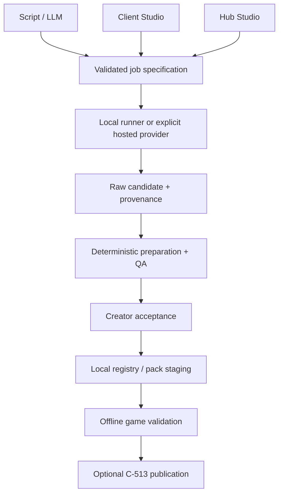

# Asset generation review and recommendations (2026-09-13)

Extend C-510's portable core into a versioned asset-production workflow. Keep generation, acceptance, game binding and community publication as explicit separate decisions. All three front doors—Bun/LLM, client Studio and Hub—should submit the same validated job specification. The game consumes accepted, content-addressed assets and never needs a generator to boot or play.

For Emberwatch, keep the approved terrain/tree/building sources and LPC character animation. Generate missing props and portraits through reference-controlled image workflows; benchmark ACE-Step 1.5 for instrumental music; use a dedicated sound-effect model for SFX and ambience. Evaluate Mystic07's LoRA in an isolated experiment, not as the production character dependency.

## Import reconciliation (2026-09-13)

This document was authored against baseline `813d056`. It was imported into the
repository later the same day, together with its contracts. Two facts changed
during import and override the historical findings below:

- **C-512 shipped.** [PR #341](https://github.com/BearlySleeping/aikami/pull/341)
  (`105e1869e`) landed the Creator Studio, `generated_asset_workflow.ts`,
  `views/studio/`, registry listing/rename/delete and registry-first NPC portrait
  resolution. The "absent from the tree" findings in this review are historical,
  not current. Residual C-512 gaps are recorded in the C-512 contract's execution
  report and folded into C-513's execution scope.
- **Contract IDs were renumbered.** The review pack proposed C-516–C-523, but
  C-516 is the combat direct-control contract. The asset-generation series is
  imported as **C-517–C-524** (request correctness, provenance, jobs, image
  preparation, audio preparation, Hub/client runner access, Emberwatch pilot,
  hosted providers). The C-512/C-513 integration addendum has been merged into
  the C-513 contract, which owns publication.

The contracts and their live status are listed in `docs/contracts/PROGRESS.md`; each contract's `Dependencies` row carries the ordering.
The authored Emberwatch production brief lives at
`docs/plans/emberwatch_asset_brief.json` with its schema at
`docs/plans/emberwatch_asset_brief.schema.json`.

Recommended execution order, one PR per contract:

1. **C-517** generation request and format correctness.
2. **C-518** durable provenance and candidate records.
3. **C-519** durable local jobs and asset-brief execution.
4. **C-512** integration residuals (now folded into C-513; C-512 itself is merged).
5. **C-520** versioned image workflows and deterministic preparation.
6. **C-521** audio generation and preparation.
7. **C-522** Hub/client runner access.
8. **C-523** Emberwatch pilot and offline integration.
9. **C-513** publication, closing the folded C-512 residuals before any community release.
10. **C-524** optional hosted provider comparison, only when credentials/budget/rights permit.

## Review basis and limits

Inspected current `main` at [813d056](https://github.com/BearlySleeping/aikami/tree/813d056fe0949573aa360a44c7a349b10f2d7b00), the full recursive tree, C-510–C-515, source implementations, the Emberwatch plan/manifest, current branches, and recent PRs. No open PRs were returned at review time. Unpushed local work is not visible. This is source inspection, not a fresh execution of the repository test suites.

Provider findings below come from primary documentation retrieved on **13 September 2026**, including live model cards and API schemas. No general web-search tool was available; this is a targeted comparison of verifiable candidates, not an exhaustive market ranking. Hardware/quality/latency statements attributed to vendors have not been benchmarked here. Prices, model IDs and terms must be pinned/rechecked during implementation; do not use a provider's moving default model.

## What is actually present

| Area | Evidence at the reviewed commit | Meaning for this work |
|---|---|---|
| C-510 | [PR #336](https://github.com/BearlySleeping/aikami/pull/336), `packages/shared/local-ai/src/lib/asset_generation.ts`, `engines/`, `recipes/`, `generated_asset.ts` | Shared runner and sd.cpp/ComfyUI adapters exist. Reuse them. |
| CLI | `apps/backend/image/scripts/generate_asset.ts` | `bun run --cwd apps/backend/image generate:asset …` emits asset bytes, manifest/hash fragments and a descriptor. No new standalone generator is needed. |
| Registry | `services/assets/generated_asset_registration.ts`, `packages/frontend/storage/src/lib/assets_generated.ts` | SHA-256 verification, cache write, local-generated source and catalog-tag collision guard exist. |
| C-511 | [PR #338](https://github.com/BearlySleeping/aikami/pull/338), `engines/ace_step_engine.ts`, audio compose profile, pinned checkpoint | Local ACE-Step **v1 3.5B**, not v1.5. Music/SFX/ambient recipes exist. The shipped profile is opt-in, NVIDIA/CUDA-only. |
| C-512 | At the reviewed commit, the contract claimed implemented but `/routes/studio/assets/+page.svelte`, `services/image/generated_asset_workflow.ts`, `views/studio/` and the claimed Studio tests were absent; direct file reads returned 404. **Since implemented** in [PR #341](https://github.com/BearlySleeping/aikami/pull/341) (`105e1869e`) | Historical divergence, now resolved. Remaining gaps (multi-emotion expression packs, Studio audio path, executed production E2E/visual evidence) are folded into C-513's execution scope. |
| C-513 | Draft contract; community-asset routes/tables still absent from the surface | Not yet implemented. Finish this contract with the rights/private-staging corrections merged from the integration addendum. Do not create duplicate publication infrastructure. |
| C-514/C-515 | [PR #337](https://github.com/BearlySleeping/aikami/pull/337), [PR #340](https://github.com/BearlySleeping/aikami/pull/340) | Combat turn/action and tactical-query work has landed. Asset work must preserve its budgets, terrain rules and world-space queries. |
| Hub | Existing catalog, LPC preview and Map Studio; `hub/src/lib/server/api/index.ts` has map community routes | Reuse the current catalog/editor and identity infrastructure. Hub asset generation is a new front door, not already implemented. |
| Emberwatch | [Plan](https://github.com/BearlySleeping/aikami/blob/813d056fe0949573aa360a44c7a349b10f2d7b00/docs/plans/emberwatch_rebuild.md), manifest 4.2.0, five maps, ten NPCs, four quests | Structural enlargement, props and corner16 groundwork exist. Full art-directed layout, story correctness and release proof are not all complete. |

## Fix these before measuring model quality

1. **The audio subject is discarded.** In `ace_step_engine.ts`, request construction uses `request.tags?.trim() ? request.tags : request.positivePrompt`. Every shipped audio recipe provides generic tags. Thus “metal gate slam” can become only “sound effect, one-shot, foley, no music.” Compile the subject and tags together; test the actual HTTP payload. BPM/key currently appear in result metadata without being effective native controls in this adapter—label them requested values, not measurements or guaranteed conditioning.
2. **Portrait/expression format mismatch.** Recipes declare `.webp`; the image engine can return PNG, and `toGeneratedAsset` rejects the mismatch. C-512 now ships an extension-reconciliation seam in `generated_asset_workflow.ts`, but the recipe data still lies and should be fixed at the source (C-517). Make immediate recipe outputs honest, then use explicit transcoding profiles. Never rename PNG bytes to `.webp`.
3. **Browser audio transport is incomplete.** ACE-Step v1 returns `output_path`; the adapter requires an injected filesystem reader and the CLI needs `--audio-output-mount` or `MODELS_PATH`. Browser code cannot read that container path. Use a local runner with scoped artifact retrieval; ACE-Step v1.5 also has an HTTP artifact API, but still needs access controls at Aikami's boundary.
4. **ComfyUI is not currently a general workflow engine.** Its adapter builds an SD-style `CheckpointLoaderSimple`/`KSampler` graph and declares `lora`, reference images, masks and ControlNet unsupported. Adding a LoRA name to JSON cannot make the Mystic FLUX.2 workflow work. Implement pinned workflow profiles and real capability validation.
5. **Generation history is lost at the registry boundary.** The generated descriptor contains engine/model/prompt/seed, but the current write call persists `provenance.source` into attribution, not the complete descriptor. After reload, a model string alone cannot prove which weights, LoRA, input rights or recipe produced a file. Persist a versioned private record and a deliberately redacted publication projection.
6. **No postprocessor exists.** The recipe registry rejects any nonempty `output.postprocess`. “Transparent-friendly” and “loopable” are prompt words, not alpha/loop guarantees. Add deterministic validators and transformation records.
7. **Per-instance serialization is insufficient across front doors.** New CLI invocations/client tabs instantiate independent engines. A shared local runner must arbitrate one GPU resource across image/music/SFX jobs and recover uncertain submissions without blindly regenerating.
8. **Audio routing is too generic for a story pack.** Music recipes all tag `music:exploration:*`; the current BGM resolver chooses a first matching manifest entry, and ambient lookup falls back to the first ambient entry. That does not establish a specific village/shrine/ending binding, nor prove freshly registered tracks appear in the selection index. C-523 must connect explicit pack cues to the registry and current playback system.
9. **A legacy converter is not a reusable finishing pipeline.** `scripts/src/lib/ops/convert_audio.ts` has hardcoded old-assets inputs and bundled-static outputs. Reuse its codec intent only; create a profile-driven, content-addressed processor instead of reviving those output paths.

## September 2026 provider shortlist

“Recommended” means best fit to Aikami's requirements among these inspected options, subject to the Emberwatch benchmark. It does not claim a measured universal winner.

| Asset task | Recommended default / candidate | Why | Constraint / fallback |
|---|---|---|---|
| Playable NPC animation | Existing deterministic LPC compositor/catalog | Already integrated; stable component IDs, known actions/directions, repeatable assembly and attribution | Preserve existing characters. Generation may supply portraits or optional experiments; an attractive sheet alone is insufficient. |
| Local props, landmark variants, portrait edits | **FLUX.2-klein-base-4B** through a pinned ComfyUI profile | Official card: Apache-2.0, generation and multi-reference editing, supported in ComfyUI/Diffusers | Card quotes about 13 GB VRAM; benchmark on actual hardware. Keep sd.cpp baseline for machines that cannot run it. Do not apply a 9B LoRA to the 4B model. |
| Alternative local image editing | **Qwen-Image-Edit-2511** | Official Apache-2.0 card emphasizes improved consistency and editing | Separate heavier challenger, not another default model download. Compare identity/palette/ground-contact preservation on the same briefs. |
| Purpose-built hosted sprite/animation challenger | **PixelLab API** | Retrieved OpenAPI exposes image generation, rotation, text/skeleton animation and inpainting | Validate its actual frame order/size with LPC, current terms and cost. API evidence does not establish resale/community redistribution rights. |
| Local sprite-sheet experiment | **Mystic07/flux-lora-spritesheet** on **FLUX.2-klein-base-9B** | Card names `gmsspritesheet`, 18,706 LPC-style training images, final checkpoint `gmsspritesheet1.safetensors` | Metadata points to FLUX.1-dev while text names FLUX.2 9B. Base license is non-commercial/non-production; dataset provenance is not itemized on the card and sample images are “coming soon.” Research lane only until rights and LPC fidelity are proven. |
| Local instrumental music | **ACE-Step 1.5 2B turbo first**, SFT/XL as hardware-dependent challengers | MIT project and inspected model card; documented async REST submit/query/download, instrumentals, longer compositions, reference/edit controls | This is an adapter/profile upgrade from current v1, not a model-name swap. Vendor claims low-VRAM modes; benchmark startup, full model set and latency locally. XL documentation requires ≥12 GB with offload, ≥20 GB recommended. |
| Local SFX and ambient field sound | **Stable Audio Open 1.0** candidate | Official card explicitly says it is better at sound effects/field recordings than music; up to 47 s, 44.1 kHz stereo | Gated weights and Stability Community/commercial terms must be checked. Not Apache/MIT. Use recorded/appropriately licensed audio when eligibility or quality fails. |
| Hosted SFX comparison | **ElevenLabs Sound Effects** | Documented 0.1–30 s effects, looping option, official API | Terms, rate limits and explicit budget apply. Looping output may be MP3; preserve lossy lineage and verify the decoded seam. |
| Hosted music comparison | **Eleven Music**, explicit `music_v2_5` if the account/API supports the documented version | Current docs expose composition plans, reference audio and inpainting; Music API for paid subscribers | Plan/model-specific rights apply. Check standalone game use separately from re-distribution of downloadable asset files. Do not make hosted generation a boot requirement. |

Do not add unofficial Suno/Udio automation as a core dependency. A documented API and usable output terms are prerequisites, not an assumption based on a consumer web app. Do not use one music model for every audio category simply because the transport accepts text.

## Licensing model correction

C-510/C-513 contain language that generated assets “inherit the model licence.” That is not a sound general rule. Distinguish: code license; base weights' inference/production terms; LoRA terms; reference/source asset rights; generated-output use rights; game redistribution; and standalone/community redistribution. Record source URLs, revisions, the chosen license option where dual-licensed, account/plan evidence where relevant, and a reviewed decision for each intended use.

The inspected FLUX.2 9B license calls out non-commercial/non-production use and end-user-facing use restrictions; its restrictions also mention data produced by the model. This is a concrete reason not to ship Mystic07 as the user-facing default. Do not infer that every model weight license applies identically to outputs. Do not label generated art CC0 or invent an artist.

C-513's pending assets must also be **private at the blob delivery layer**. Hiding a D1 row from public listings does not make an object private in a public catalog bucket. Keep pending bytes in private staging or behind an authenticated delivery path, then publish immutable approved revisions.

## One production pipeline

The portable TypeScript core owns schemas, recipe compilation, descriptor derivation and validation. Host adapters own filesystem, GPU scheduling, OPFS, HTTP and secrets. Do not import Bun/fs/Svelte into `@aikami/local-ai`. Persist device-authoring records in the established local data plane; keep Hub account/publication data in D1 and blobs in R2. Reuse the repository's AI gateway/local-stack connection settings where appropriate, but do not route image/audio generation through a text-LLM transport.

For Hub access to a local GPU, use a **local runner that initiates an authenticated outbound connection** and claims jobs for one paired account/device. Cloudflare cannot call a user's localhost. Avoid exposing ComfyUI or ACE-Step publicly or putting a public reverse proxy in front of arbitrary workflows. Direct client-to-loopback support must pass real browser origin/private-network checks; when unavailable, offer export/import and a clear explanation. Local CLI/client use must not require Hub pairing or sign-in.

Cache accepted outputs by content hash. Lock inputs/recipe/workflow/model revisions before submission. Seeds improve repeatability but do not promise identical diffusion bytes across hardware/kernel versions. Resume reuses verified results; it does not regenerate them to “check determinism.”

## Emberwatch pilot and improvements

The attached brief starts with a small vertical slice: one useful missing prop, aligned ward-state art, one NPC portrait, one instrumental loop, one ambient loop and a short effect. It then expands to props/furniture, the full ten-NPC portrait set, four music cues, four ambience cues and eight effects. The script prints exact counts and cost estimates before running; default hosted budget is zero and each item has at most two candidates.

Preserve the current five-map topology and identities. Improve composition around the ward tree, entrances and market; keep the old-road bridge/trail routes legible and the shrine's pillars solid with its center passable. Do not enlarge scenes again merely to fit generated art. The initial plan explicitly keeps approved grass/earth/gravel/water and LPC animation; reuse those sources instead of re-rolling the whole pack. Furniture belongs in irregular prop frames, not distorted into terrain tiles. The current terrain atlas has one frame free (175/176), so another terrain or frame requires an explicit capacity change rather than an overflowing painter.

Use a restrained audio identity: a recurring original three-note ward motif, timber/soft reed/plucked strings, sparse percussion; no voices by default. Village and inn are warm, road music is exposed and uncertain, shrine music is sparse. Effects and ambience must remain independent of the music track. Ending art/audio bind to authoritative saved ending flags only; before story correctness lands, keep them disabled/pending rather than letting an LLM or map entry select an ending. Missing receipt/component interactions or unfinishable quest paths remain release blockers, not audio-generation tasks.

Benchmark **accepted usable assets per hour**, including manual cleanup, not just seconds per generation. Record wall time, peak VRAM/RAM, output/decoded size, failure rate, rejected candidates, edit time, cost per accepted asset and subjective review scores. Hard failures—missing directions, false alpha, inaccessible doors, looping click, wrong subject, unknown publication rights—cannot be averaged away by attractive results.

## Execution directives

These directives apply to every contract in the C-517–C-524 series. They replace
the standalone execution prompts that accompanied the original review pack; the
per-contract "inspect these seams", implementation order and critical trap live
in each contract.

- **One contract per PR.** Execute one selected contract and its acceptance
  criteria in full; do not implement the whole program at once. Inspect current
  HEAD and existing C-510–C-515 source before creating files; a historical gap
  in this review is not proof the gap exists today.
- **Portable core stays portable.** `packages/shared/local-ai` remains TypeScript
  with no Bun/fs/Svelte imports. Reuse `GenerationEngineClient`, recipe
  compilation, `runAssetGeneration` and `toGeneratedAsset`; host
  filesystem/GPU/HTTP work stays behind adapters.
- **TypeBox owns cross-boundary schemas**, with types derived via `Static` and
  re-exported from `packages/shared/types`. Do not inject fields into strict
  content/scene schemas without implementing their readers first.
- **Data planes are fixed.** Player assets/saves/campaigns are local (Turso);
  D1 owns account/community/Hub dispatch; R2 owns published and private-staging
  blobs. The game boots, plays and saves offline without sign-in. Never
  reintroduce a cloud boot dependency.
- **One job protocol, one scheduler.** CLI/LLM, client and Hub submit the same
  validated job specification; one local runner arbitrates the shared GPU. UIs
  call services — no transport, SQL or OPFS in view models.
- **Immutability and honesty.** Accepted assets are immutable content-addressed
  bytes. Never fabricate hashes, license grants, artist names, measurements,
  screenshots or passing tests. Mark unexecuted checks unverified; do not claim
  `release_verified` while mandatory evidence or story gates are missing.
- **Hosted providers are opt-in.** Server-side secrets, explicit bounded cost
  reservations, default spend zero, no paid auto-fallback, no gated-model
  downloads without established eligibility.
- **Finish with evidence.** Run touched-project tests, typecheck/lint, guards and
  `bun moon run :validate`. Use compiled Svelte tests for reactivity, native-scale
  production screenshots for visual work, and real listening (at least five loop
  repeats) for audio. End each PR with problem, concrete behavior, modified
  seams, migration/rollback, AC-by-AC evidence, remaining blockers and the next
  dependent contract.

The manifest `docs/plans/emberwatch_asset_brief.json` is an authored production
brief implemented by C-519; it is not a `ContentPackManifest` and must never
overwrite `content/packs/emberwatch/manifest.json`. Run `--plan` first, slice
before expansion, and preserve approved originals, semantic IDs and old pack
locks.

## Sources

Repository paths above are relative to the pinned commit. Primary external sources retrieved 2026-09-13:

1. [Mystic07 card](https://huggingface.co/Mystic07/flux-lora-spritesheet), [raw card](https://huggingface.co/Mystic07/flux-lora-spritesheet/raw/main/README.md).
2. [FLUX.2-klein-base-4B card](https://huggingface.co/black-forest-labs/FLUX.2-klein-base-4B), [9B license](https://huggingface.co/black-forest-labs/FLUX.2-klein-base-9B/blob/main/LICENSE.md). The 9B raw card required authentication; its public license page was readable.
3. [Qwen-Image-Edit-2511](https://huggingface.co/Qwen/Qwen-Image-Edit-2511).
4. [PixelLab docs](https://www.pixellab.ai/docs), [retrieved v1 OpenAPI](https://api.pixellab.ai/v1/openapi.json). Terms were not established from the attempted `/terms` URL, which returned marketing content.
5. [ACE-Step 1.5](https://github.com/ace-step/ACE-Step-1.5), [REST API](https://github.com/ace-step/ACE-Step-1.5/blob/main/docs/en/API.md), [model card](https://huggingface.co/ACE-Step/Ace-Step1.5).
6. [Stable Audio Open 1.0 card](https://huggingface.co/stabilityai/stable-audio-open-1.0), [Stability licensing](https://stability.ai/license). Public card read; no gated weights downloaded.
7. [ElevenLabs SFX](https://elevenlabs.io/docs/overview/capabilities/sound-effects), [SFX API](https://elevenlabs.io/docs/api-reference/text-to-sound-effects/convert).
8. [Eleven Music](https://elevenlabs.io/docs/overview/capabilities/music), [Music terms](https://elevenlabs.io/music-terms), [model-specific terms](https://elevenlabs.io/eleven-music-model-specific-terms). The overview and general Music terms were readable; the model-specific terms URL returned 403, so account/model-specific redistribution permission remains unverified.
